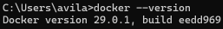
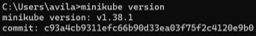
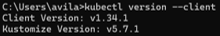
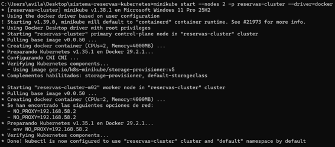
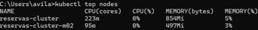
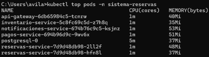

# Sistema Distribuido de Reservas de Entradas
#### Practica Tolerancia a fallos

#### Integrantes:
- Diana Avila Macas
- Sebastian Cabrera Meza


### Descripción

Este proyecto implementa un sistema distribuido de reserva de entradas para eventos desplegado sobre un clúster Kubernetes de dos nodos. La arquitectura está compuesta por microservicios comunicados mediante REST e incluye mecanismos de resiliencia como Circuit Breaker, Retry con Exponential Backoff, Rate Limiting, Bulkhead y Horizontal Pod Autoscaler (HPA).

---

### Componentes

- API Gateway
- Servicio de Reservas
- Servicio de Inventario
- Servicio de Pagos (Stub)
- Servicio de Notificaciones (Stub)
- PostgreSQL

---

### Requisitos

- Docker Desktop 29 o superior
- Minikube 1.38 o superior
- Kubernetes 1.35
- kubectl

Verificar la instalación:

```bash
docker --version
```
<p align="center">
    
</p>

```
minikube version
```
<p align="center">
    
</p>

```
kubectl version --client
```
<p align="center">
    
</p>


---

### Crear el clúster

```bash
minikube start --nodes 2 -p reservas-cluster --driver=docker
```
<p align="center">
    
</p>

Verificar:

```bash
kubectl get nodes
```
<p align="center">
    
</p>


---

### Habilitar Metrics Server

```bash
minikube addons enable metrics-server -p reservas-cluster
```
<p align="center">
    
</p>


Comprobar:

```bash
kubectl top nodes
```

---

### Construir las imágenes

```bash
docker build -t inventario-service:1.0 ./inventario-service
docker build -t pagos-service:1.0 ./pagos-service
docker build -t notificaciones-service:1.0 ./notificaciones-service
docker build -t reservas-service:2.0 ./reservas-service
docker build -t api-gateway:2.0 ./api-gateway
```

---

### Cargar las imágenes en Minikube

```bash
minikube image load inventario-service:1.0 -p reservas-cluster
minikube image load pagos-service:1.0 -p reservas-cluster
minikube image load notificaciones-service:1.0 -p reservas-cluster
minikube image load reservas-service:2.0 -p reservas-cluster
minikube image load api-gateway:2.0 -p reservas-cluster
```

---

### Desplegar la aplicación

```bash
kubectl apply -f kubernetes/
```

---

### Verificar el despliegue

```bash
kubectl get all -n sistema-reservas

kubectl get pods -n sistema-reservas

kubectl get pods -n sistema-reservas -o wide

kubectl get hpa -n sistema-reservas

kubectl top pods -n sistema-reservas
```

---

### Acceder al sistema

```bash
kubectl port-forward service/api-gateway 8080:80 -n sistema-reservas
```

Probar el estado del Gateway:

```bash
curl http://localhost:8080/health
```

Crear una reserva:

```json
{
  "usuario":"Usuario1",
  "correo":"usuario1@gmail.com",
  "evento_id":1,
  "cantidad":1,
  "monto":25
}
```

---

### Pruebas de resiliencia

Los scripts ubicados en la carpeta `chaos/` permiten ejecutar los experimentos solicitados:

- Inventario Fantasma
- Pasarela Lenta
- Diluvio de Peticiones
- Correo Perdido

Después de cada experimento puede restaurarse el sistema mediante:

```bash
.\chaos\05-restaurar-servicios.ps1
```

---

### Arquitectura

La aplicación utiliza un clúster Kubernetes compuesto por dos nodos:

- reservas-cluster (Control Plane)
- reservas-cluster-m02 (Worker)

El Servicio de Reservas se despliega con dos réplicas distribuidas entre ambos nodos para garantizar alta disponibilidad.

---
